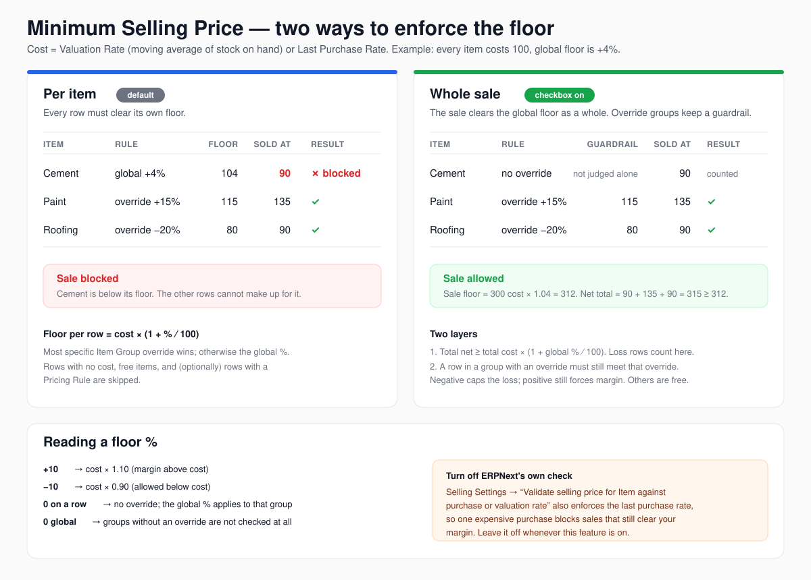

### Cecypo PowerPack

Gives ERPNext Power ups! :facepunch:

### Features

Most features are toggled individually via **PowerPack Settings**; a few marked *(always on)* below ship with no switch.

| Feature | Description |
|---|---|
| **Compact Theme** | Reduces line-height and input sizes for a denser layout across the entire desk |
| **POS Powerup** | Compact/thumbnail view toggle, wildcard `%` and multi-word search, keyboard nav, barcode feedback |
| **Sales Powerup** | Inline stock, valuation rate, last purchase price, last sale price and profit margin on Quotation / SO / SI / POS Invoice item lines |
| **Bulk Selection** | Bulk item selector dialog on Quotation, Sales Order, Sales Invoice, Purchase Order, Stock Reconciliation and Stock Entry |
| **Item Search Powerup** | Replaces ERPNext's default item search on all forms with multi-word (space-separated AND) and wildcard (`%`) search |
| **Payment Reconciliation Powerup** | Zero Allocate, Zero Reconcile, 2% Allocate (Kenya VAT withholding), and enhanced doc info on the Payment Reconciliation form |
| **Public Document Links** | Generates short public URLs (`/s/{name}-{token}`) for sharing Quotations, Invoices etc. with customers — includes a branded viewer page and optional Frappe Builder block |
| **Duplicate Tax ID Check** | Warns before saving a Customer or Supplier whose Tax ID is already in use |
| **ETR Invoice Cancellation Guard** | Prevents cancellation of Sales/POS Invoices that have an ETR number set |
| **Warnings** | Future bill-date alert on Purchase Invoice; overdue invoice popup when selecting a customer on sales documents |
| **Price List Importer** | Bulk-update item prices via CSV/Excel directly from the Item Price list view |
| **Lens** | One-click item insights panel on every item row — recent sales to the current customer and to others, purchase history, all price lists, and live stock count with per-warehouse breakdown on hover. On Purchase Receipt and Purchase Invoice, update price list values directly from the panel |
| **Minimum Selling Price** | Ensure profitable margin targets based off valuation or last purchase price. Easily manage all your items by simply setting the floor %age per Item Group! |
| **Email Queue Preview** *(always on)* | Renders the Email Queue message inline as the actual HTML email instead of raw MIME source, with a **View Raw Source** toggle to flip back |

##### Centralized Settings to enable/disable features

##### Bulk Price Update

##### Compact POS + enhanced search

##### Duplicate customer or supplier soft warning

##### Power Sales


**Powerup ▸ Show / Hide Item Insights** on a Quotation, Sales Order, Sales Invoice or POS Invoice. Under each item: stock, cost, last purchase, last sale and last sale to this customer, stated the way the row is priced (its UOM, the document currency, and incl. tax when rates include tax; `+` means tax is added on top). The badge is the row's margin; hover it for the working (net − cost = profit per unit, margin and markup).

Margin is always profit ÷ net (ex-tax) sale, so the same deal shows the same margin whatever the tax template. The summary by the Items label covers only rows with a cost; **Costed 4/5** means one row has none (service item, no valuation) and is left out — hover it to see which. Cost figures (cost, last purchase, badge, summary) are only sent to users with the **Visible to Role** set in PowerPack Settings, and only to desk users who can read that document type for its company and customer; the badge colour bands are set there too. The Bulk Selection dialog's cost column is likewise withheld server-side from anyone outside System, Stock, Accounts or Sales Master Manager.
##### Bulk Selection for QT/SO/SI + enhanced search

##### Price List Importer
A custom and simple price list updater. On `/desk/item-price/`, open **Powerup** and select **"Import Prices"** — no rows need to be selected. Required columns: `item_code`, `price_list`, `rate`. That's it — no ID's!

##### Copy as Message (QT/SO/SI/PO)
**Powerup ▸ Copy as Message** on a Quotation, Sales Order or Sales Invoice copies a short message with a public link to the document, ready to paste into WhatsApp, SMS or email. Your bank / paybill details go in the `PAYMENT_DETAILS` block at the top of each script (per Company, `'*'` for any) and are added while the document is unpaid.

On a **Purchase Order** the message is for the supplier: PO number, your company and date, Required By, total, and the link; it says so when the PO is a Draft, On Hold or Closed. There are no payment details; instead a `NOTES` block (per Company, `'*'` for any) is added to the end, e.g. delivery instructions or "quote the PO number on your invoice". The public link page shows your PowerPack Public Link banner, header and footer on every document type, so keep customer-only wording (such as payment prompts) out of them if you send POs this way.

These are ordinary Client Scripts (`PowerPack - Copy as Message (…)`) that PowerPack creates only when missing. They belong to your site: edit them, or untick **Enabled** to switch one off — updates never overwrite them. To get the latest shipped version, delete the script and run `bench migrate`. The older hand-made `SI - Copy to Clipboard` script is disabled (not deleted) when they are created, so copy its bank details across.

##### Copy as Image (QT/SO/SI/PO)
**Powerup ▸ Copy as Image** on a Quotation, Sales Order, Sales Invoice or Purchase Order puts a picture of the document's print on the clipboard — paste it straight into WhatsApp, Telegram or any chat. The print preview (`/app/print/…`) of those documents gets a **Copy as Image** button too, which uses the print format, letterhead and language selected there; the form button uses the defaults.

The image is rendered on the server from the same PDF the **PDF** button downloads, so it looks exactly like the print. Every page is stacked into one tall image (up to 10 pages), and blank pages and space at the end are trimmed. It shows the saved document, so save first, and it needs Print permission. Raw printing formats (ESC/P, ESC/POS) are printer commands with nothing to picture: if a doctype's default format is one, use the print preview and pick another. If the browser cannot put an image on the clipboard, the PNG is downloaded instead. Switch it off with **Enable Copy as Image** in PowerPack Settings ▸ Sales & POS.

##### Rate Price Picker (QT/SO/SI)
Click or tab into an item's **Rate** on a Quotation, Sales Order or Sales Invoice and a dropdown lists that item's price on every enabled selling price list in the document's currency (for the row's UOM, customer-specific and dated prices respected, as ERPNext would fetch them), then an editable **Custom Price** when you are allowed to change the rate. ↑/↓ and Enter pick, Esc closes, Alt+↓ reopens, and typing straight into Rate keeps your own figure. Picking a list price sets it as the row's list price with no discount or margin; Custom Price sets the rate as if typed. When Rate is read-only (a fixed price) the lists are still offered but not Custom Price; without permission to change the rate at all, they are shown for reference only. With **Minimum Selling Price** on, prices below the floor are tagged *below min* (advisory: saving still runs the normal check). As in ERPNext, changing Qty afterwards re-applies the document's price list, and a Pricing Rule on the row is re-applied on save, so pick after setting Qty. If Stock Settings writes transaction prices back to the price list on the *Price List Rate* basis, a pick sets only the rate, so it cannot rewrite the document's own price list. Off by default: **Enable Rate Price Picker** in PowerPack Settings ▸ Sales & POS.

##### Minimum Selling Price
Ensure profitable margin targets based off valuation or last purchase price. Easily manage all your items by simply setting the floor %age per Item Group!


Two ways to enforce the floor. **Per item** (default) checks every row against its own floor. **Whole sale** (checkbox) lets some rows go below cost as long as the sale as a whole clears the global %, while groups with an override keep a per-row guardrail. Turn off ERPNext's *Validate Selling Price* in Selling Settings whenever this feature is on: it also enforces the last purchase rate.

##### Lens
Look for the lens icon next to each item. In Sales, shows the last few sales with the item's price for the current customer, and sales to other customers. Also shows all price lists for the item. In one click, know your item! In Purchase Receipt and Purchase Invoice, if allowed, lets you set new price list values directly. Stock count is shown in the top-right, and hovering over it shows stock for other warehouses!


### Installation

You can install this app using the [bench](https://github.com/frappe/bench) CLI:

```bash
cd $PATH_TO_YOUR_BENCH
bench get-app $URL_OF_THIS_REPO --branch develop
bench install-app cecypo_powerpack
```

### API

#### `get_document_public_link(doctype, name)`

Generates a public shareable link for any document (Quotation, Sales Invoice, etc.) that a customer can open to view/print without logging in. The caller must have read permission on the document, otherwise it raises `PermissionError`.

In a print format use the Jinja method of the same name, which does not check permission (a shared link renders the print format as Guest): `{{ get_document_public_link(doc.doctype, doc.name) }}`.

Compatible with both Frappe v15 and v16+.

> **v15 note:** Requires `allow_older_web_view_links` enabled in System Settings.
> **v16+ note:** Uses `DocumentShareKey` with configurable expiry (`document_share_key_expiry` in System Settings, default 90 days).

**JavaScript:**
```javascript
frappe.call({
    method: 'cecypo_powerpack.api.get_document_public_link',
    args: { doctype: frm.doc.doctype, name: frm.doc.name },
    callback(r) {
        // r.message is the shareable URL, e.g.:
        // https://yoursite.com/s/QTN-0001-x7kQ
    }
});
```

**REST:**
```
GET /api/method/cecypo_powerpack.api.get_document_public_link?doctype=Quotation&name=QTN-0001
```

### License

mit
